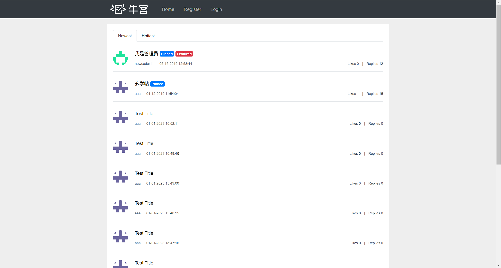
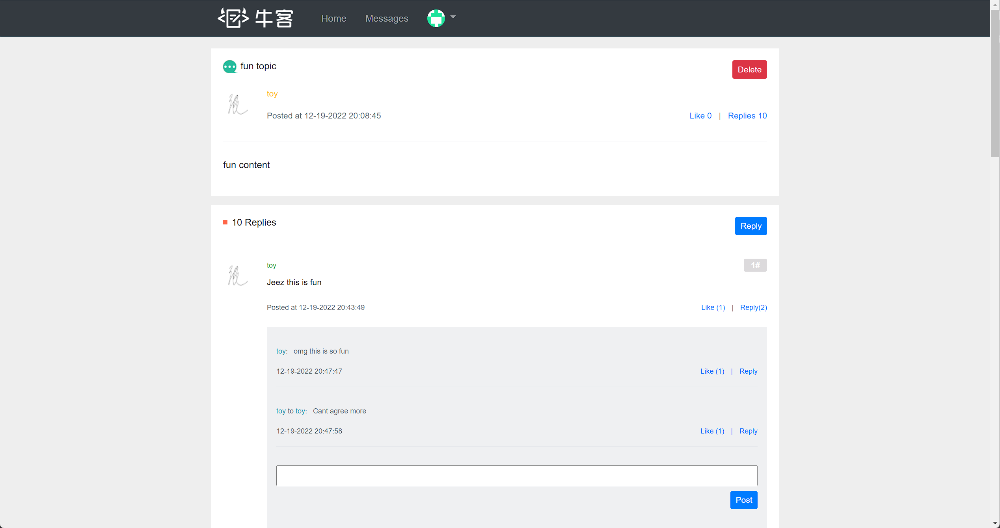
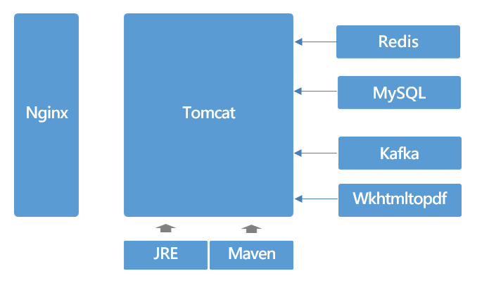

# README

## Intro

A developer community named Nowcoder. Built using Spring Boot, Spring MVC, Thymeleaf, MyBatis, Redis and Kafka.





## Switching between dev and prod

In order to switch the project to dev/prod mode, just open application.properties and change the value to the one you
desire.

## Running the project (dev)

The project is developed under the IntelliJ Idea environment. For your best experience, I recommend to run the project
using IntelliJ too.

Below are the necessary steps to install the technologies used in the project.

1. Install Maven and add it to the system path.
2. Install MySQL. Run init_data.sql and init_schema.sql to initialize the database with the tables and the mock data.
3. Install Redis and add it to the system path.
4. Install wkhtmltopdf and add it to the system path.
5. Install Kafka. Add the path to its bin folder to your system path.
6. Fill out secrets.properties with all the credentials like the link to your database.

Once all the installation and configuration steps are done, perform below steps before running the project:

1. Go to your kafka installation directory, and then open config/server.directory. Change log.dirs to where your desired
   path to save the logs is.
2. Similarly, open zookeeper.properties under the same directory, and change dataDir to where you wish the logs to be.

Now run the project:

1. CD to your kafka directory, and run the following command to start the zookeeper server:
   <code>.\bin\windows\zookeeper-server-start.bat .\config\zookeeper.properties</code>
2. Similarly, run the command below to start the Kafka service:
   <code>.\bin\windows\kafka-server-start.bat .\config\server.properties</code>
3. Make sure that you run the project using JDK 11.

## Running the project (prod/linux)

Some preparation steps:

1. Install Maven, MySQL, Redis, Tomcat, Kafka and Nginx. Also make sure to add mvn and tomcat to PATH.
2. Start Tomcat
   <code>cd %tomcat installation directory%/bin</code>
   <code>./startup.sh</code>
3. Start Kafka server

   a. <code>cd %kafka installation directory%</code>

   b. <code>sudo bin/zookeeper-server-start.sh -daemon config/zookeeper.properties </code>

   c. <code>sudo nohup bin/kafka-server-start.sh config/server.properties 1>/dev/null 2>&1 &</code>

   d. Make sure to test the server using the command <code>bin/kafka-topics.sh --list --bootstrap-server %your internal
   ip%:9092</code>
4. Start Nginx server

   a. Open /etc/nginx/nginx.conf. In the http section, attach the following code:

   ```
      upstream myserver {
             server 127.0.0.1:8080 max_fails=3 fail_timeout=30s;
      }
      server {
             listen 80;
             server_name %Your external IP%;
             location / {
                     proxy_pass http://myserver;
             }
     }
   ```

   b. Start the server.

   <code>systemctl start nginx</code>

## Authority

This project classifies users into three groups: normal user, admin and moderator. An admin is allowed to delete posts,
query website data like beans and logs at /actuator, and calculate DAU and UV at /data. A moderator is allowed to pin or
mark a post as feature. A normal user is granted access to all other functionalities.

Sample moderator account:
nowcoder22
123456

Sample admin account:
nowcoder11
123456